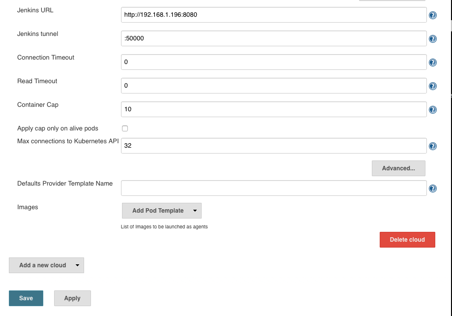

# GL-DevOps-Challenge

Welcome to the GL DevOps Challence to implement Hygieia `https://github.com/capitalone/Hygieia` on Docker containers.

In this folder you will find the terraform IaC files (challenge.tf and variables.tf) needed to build:

* Jenkins t2.micro instance -> t2.small (for doing local builds, k8s buils t2.micro is fine)
* MongoDB t2.micro instance
* Kubernetes Master t2.small instance
* Kubernetes Worker x 2 t2.small instances

Ansible was used as the Configuration Management for this project, and the files are:

* playbook.yml
* group_vars/*
* roles/*
* templates/*

For the playbook, created a single `playbook.yml` file with tags that are called from a `local-exec` in the terraform configuration file, specifically in `challenge.tf`.

The Kubernetes Cluster generation is fully automated, with the exception of the client certificate for the jenkins-kubernetes-plugin, which is a PKCS12 key with the kubernetes-admin credentials of the cluster.

The Jenkins setup process is not automated, but it shows the initial wizard screen, and the Kubernetes Jenkins plugin should be installed and configured manually.

The idea behind this, is to use the Kubernetes cluster for the builds. The pipeline  launches a Pod (buildpod-*) with the containers nedded to build the parts of the project.  A Jenkinsfile (declarative pipeline) is provided at the root of this repository `https://github.com/ramirezalfredo/Hygieia`.

Final Jenkinsfile does a local build, Jenkinsfile-k8s is the original version that i have to left behind, but this is the configuration of the Kubernetes plugin for Jenkins:

TODO:

* Add a volume to the cluster for the workDir at the jnlp container, for caching the $HOME/.m2 directory, and caching for the subsecuent builds using this method.
* Win the challenge :)