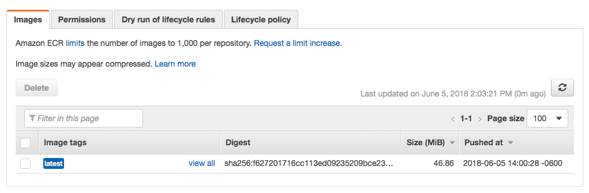

# GL-DevOps-Challenge

Welcome to the GL DevOps Challence to implement Hygieia `https://github.com/capitalone/Hygieia` on Docker containers.

## Infrastructure as Code

In this folder you will find the terraform IaC files (main.tf and variables.tf) needed to launch:

* Jenkins t2.micro instance -> t2.small (for doing local builds, k8s buils t2.micro is fine)
* Kubernetes Master = 1 x t2.small instance
* Kubernetes Worker = 3 x t2.small instances

## Configuration Management

Ansible was used as the Configuration Management for this project, and the files can be located at the root of this folder:

* site.yml (master playbook)
* jenkins.yml
* k8s-master.yml
* k8s-worker.yml
* mongodb.yml (not in use anymore, mongodb will be a Pod)
* group_vars/*
* roles/*
* templates/*

For the playbook, created a single `playbook.yml` file with tags that are called from a `local-exec` in the terraform configuration file, specifically in `main.tf`.

## Building

Changed plugin configuration to 1.0 in the UI tests.

pom.xml

```xml
    <plugin>
    <groupId>com.github.eirslett</groupId>
    <artifactId>frontend-maven-plugin</artifactId>
    <!-- if you have issues with your proxy, be careful https://github.com/eirslett/frontend-maven-plugin/commit/bcd8a7883703e28e3c5346e1f34c64332994e442 -->
    <!--<version>0.0.29</version>-->
    <version>1.0</version>
    <configuration>
        <workingDirectory>./</workingDirectory>
        <skip>${frontend-maven-plugin.skip}</skip>
    </configuration>
```

Skipped Docker container for Rally (one of the collectors):

pom.xml

```xml
    <configuration>
        <!--<skipDockerBuild>false</skipDockerBuild>-->
        <skipDockerBuild>true</skipDockerBuild>
        <imageName>hygieia-rally-feature-collector</imageName>
        <dockerDirectory>${project.basedir}/docker</dockerDirectory>
```

## Kubernetes Cluster

The Kubernetes Cluster generation is fully automated, with the exception of the client certificate for the Jenkins Kubernetes plugin, which is a PKCS12 key with the kubernetes-admin credentials of the cluster.

The Jenkins setup process automated trough Ansible, but starts at the initial wizard screen, and the Kubernetes Jenkins plugin should be installed and configured manually.

## CI/CD: Jenkins pipeline

The idea behind this, was to use the Kubernetes cluster for the builds. The pipeline  launches a Pod (buildpod-*) with the containers nedded to build the parts of the project.  A Jenkinsfile (declarative pipeline) is provided at the root of this repository `https://github.com/ramirezalfredo/Hygieia`.

Final Jenkinsfile does a local build in the Jenkins master, but Jenkinsfile-k8s which is the original version, i had to leave it behind. This is the configuration of the Kubernetes plugin for Jenkins (worked with the current cluster config):


## Results

```bash
REPOSITORY                                TAG                 IMAGE ID            CREATED             SIZE
hygieia-ui                                latest              5f209214e1d3        7 minutes ago       124MB
hygieia-score-collector                   latest              5b03a82c5e75        7 minutes ago       701MB
hygieia-subversion-scm-collector          latest              50ffbb6bb3dd        7 minutes ago       508MB
hygieia-github-scm-collector              latest              c168081ca35b        7 minutes ago       500MB
hygieia-bitbucket-scm-collector           latest              27d076bab019        8 minutes ago       500MB
hygieia-appdynamics-collector             latest              7c987c72151e        8 minutes ago       500MB
hygieia-chat-ops-collector                latest              988225a5bc95        8 minutes ago       500MB
hygieia-gitlab-feature-collector          latest              b4a2acc64c0a        8 minutes ago       508MB
hygieia-versionone-collector              latest              4495d9247afc        8 minutes ago       513MB
hygieia-jira-feature-collector            latest              e0f950cec5f6        8 minutes ago       518MB
hygieia-udeploy-collector                 latest              fdba23422d43        9 minutes ago       500MB
hygieia-sonar-codequality-collector       latest              cd5ad0355eae        9 minutes ago       500MB
hygieia-jenkins-codequality-collector     latest              0faadca1c0ea        9 minutes ago       368MB
hygieia-jenkins-cucumber-test-collector   latest              66dad4dabc60        9 minutes ago       499MB
hygieia-jenkins-build-collector           latest              383b515637f3        9 minutes ago       499MB
hygieia-bamboo-build-collector            latest              35052381e849        9 minutes ago       499MB
hygieia-artifactory-artifact-collector    latest              da37a5ffc976        9 minutes ago       500MB
hygieia-apiaudit                          latest              06606f74c1ce        9 minutes ago       707MB
hygieia-api                               latest              df6c87119429        9 minutes ago       510MB
```

## Repos in AWS ECR

This is a view of the private respositories in ECR created during the process:


Content of one of the repos:



## TODO

* Add a volume to the cluster for the workDir at the jnlp container, for caching the $HOME/.m2 directory, and caching for the subsecuent builds while using this method.
* Add a volume to the cluster for the dataDir of MongoDB as a Pod.
* Deploy container images in Kubenetes cluster, expose services, attach ELB.
* Win the challenge :)
