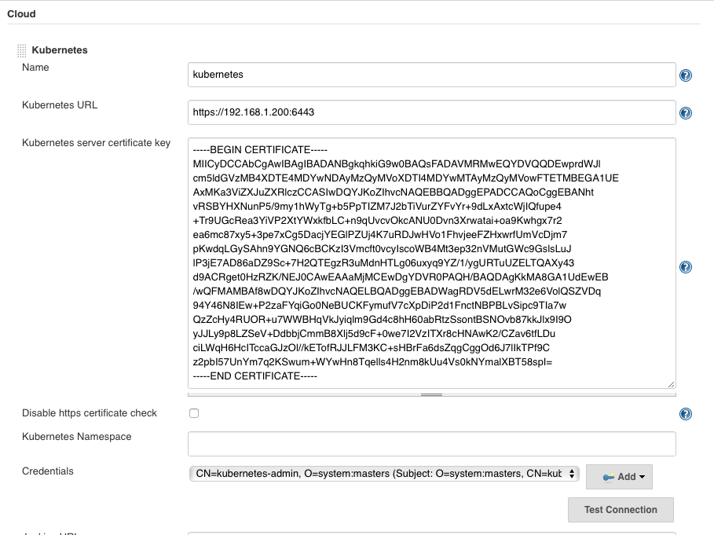

# GL-DevOps-Challenge

Welcome to the GL DevOps Challence to implement Hygieia `https://github.com/capitalone/Hygieia` on Docker containers.

In this folder you will find the terraform IaC files (challenge.tf and variables.tf) needed to build:

* Jenkins t2.micro instance -> t2.small (for doing local builds, k8s buils t2.micro is fine)
* MongoDB t2.micro instance
* Kubernetes Master t2.small instance
* Kubernetes Worker x 2 t2.small instances

Ansible was used as the Configuration Management for this project, and the files are:

* playbook.yml
* group_vars/*
* roles/*
* templates/*

For the playbook, created a single `playbook.yml` file with tags that are called from a `local-exec` in the terraform configuration file, specifically in `challenge.tf`.

The Kubernetes Cluster generation is fully automated, with the exception of the client certificate for the jenkins-kubernetes-plugin, which is a PKCS12 key with the kubernetes-admin credentials of the cluster.

The Jenkins setup process is not automated, but it shows the initial wizard screen, and the Kubernetes Jenkins plugin should be installed and configured manually.

The idea behind this, is to use the Kubernetes cluster for the builds. The pipeline  launches a Pod (buildpod-*) with the containers nedded to build the parts of the project.  A Jenkinsfile (declarative pipeline) is provided at the root of this repository `https://github.com/ramirezalfredo/Hygieia`.

Final Jenkinsfile does a local build, Jenkinsfile-k8s is the original version that i have to left behind, but this is the configuration of the Kubernetes plugin for Jenkins:




TODO:

* Add a volume to the cluster for the workDir at the jnlp container, for caching the $HOME/.m2 directory, and caching for the subsecuent builds using this method.
* push the resulting images in a registry, done...!
* Win the challenge :)

```
REPOSITORY                                TAG                 IMAGE ID            CREATED             SIZE
hygieia-ui                                latest              5f209214e1d3        7 minutes ago       124MB
hygieia-score-collector                   latest              5b03a82c5e75        7 minutes ago       701MB
hygieia-nexus-iq-collector                latest              be241b5d9343        7 minutes ago       500MB
hygieia-hspm-cmdb-collector               latest              645fcd8fa8e7        7 minutes ago       501MB
hygieia-gitlab-scm-collector              latest              2adfbe9f18ff        7 minutes ago       500MB
hygieia-subversion-scm-collector          latest              50ffbb6bb3dd        7 minutes ago       508MB
hygieia-github-scm-collector              latest              c168081ca35b        7 minutes ago       500MB
<none>                                    <none>              6a57786c7504        8 minutes ago       500MB
hygieia-bitbucket-scm-collector           latest              27d076bab019        8 minutes ago       500MB
hygieia-appdynamics-collector             latest              7c987c72151e        8 minutes ago       500MB
hygieia-chat-ops-collector                latest              988225a5bc95        8 minutes ago       500MB
hygieia-gitlab-feature-collector          latest              b4a2acc64c0a        8 minutes ago       508MB
hygieia-versionone-collector              latest              4495d9247afc        8 minutes ago       513MB
hygieia-jira-feature-collector            latest              e0f950cec5f6        8 minutes ago       518MB
hygieia-xldeploy-collector                latest              f90ad847ab9b        8 minutes ago       500MB
hygieia-udeploy-collector                 latest              fdba23422d43        9 minutes ago       500MB
hygieia-sonar-codequality-collector       latest              cd5ad0355eae        9 minutes ago       500MB
hygieia-jenkins-codequality-collector     latest              0faadca1c0ea        9 minutes ago       368MB
hygieia-jenkins-cucumber-test-collector   latest              66dad4dabc60        9 minutes ago       499MB
hygieia-jenkins-build-collector           latest              383b515637f3        9 minutes ago       499MB
hygieia-bamboo-build-collector            latest              35052381e849        9 minutes ago       499MB
hygieia-artifactory-artifact-collector    latest              da37a5ffc976        9 minutes ago       500MB
hygieia-apiaudit                          latest              06606f74c1ce        9 minutes ago       707MB
hygieia-api                               latest              df6c87119429        9 minutes ago       510MB
openjdk                                   8-jre               bef23b4b9cac        3 weeks ago         443MB
nginx                                     latest              ae513a47849c        5 weeks ago         109MB
java                                      openjdk-8-jre       e44d62cf8862        16 months ago       311MB
java                                      openjdk-8-jdk       d23bdf5b1b1b        16 months ago       643MB
```

## Repos in AWS ECR


Content of one of the repos:

